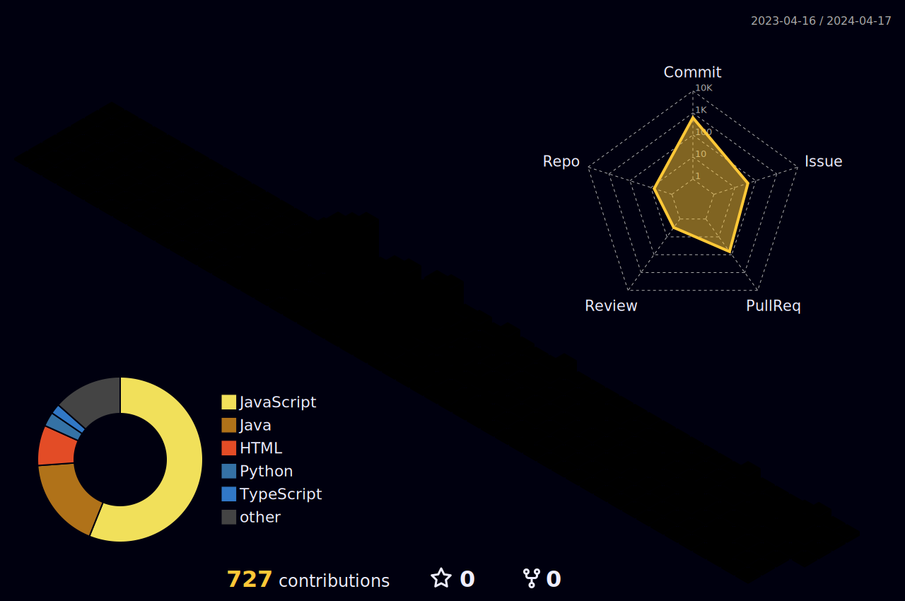

<!--
**mingdodev/mingdodev** is a ✨ _special_ ✨ repository because its `README.md` (this file) appears on your GitHub profile.

Here are some ideas to get you started:

- 🔭 I’m currently working on ...
- 👯 I’m looking to collaborate on ...
- 🤔 I’m looking for help with ...
- 💬 Ask me about ...
- 📫 How to reach me: ...
- 😄 Pronouns: ...
- ⚡ Fun fact: ...
-->

  
<strong>Hi Hello 안녕하세요 ☁️🚀✨</strong>

 

  🛠️

   

 

 

  

  🌳

   

<!-- 

  ☁️

   

studying~

  🦕

   
  헿
  Happy New Year 🐉
  히히

  

 -->
